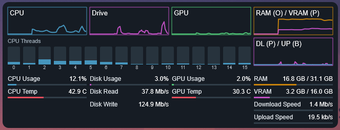

# Desktop Metres

Custom [Rainmeter](https://www.rainmeter.net/) skin inspired by [this post](https://www.hwinfo.com/forum/threads/my-rainmeter-skin.3489/).

## HWiNFO setup

The skin reads HWiNFO's shared registry values from:

`HKEY_CURRENT_USER\SOFTWARE\HWiNFO64\VSB`

The existing sensor order is defined by the `*Index` variables near the top of
`desktop_meters.ini`.

The GPU memory sensor currently supplies a percentage rather than a byte count.
`VramTotalBytes` is therefore set to `17179869184` (16 GiB) for the current GPU.
Change that variable if the skin is used with a different graphics card.

All displayed activity, temperature, usage, and transfer-rate values use the
averaged raw measures. Disk rates are converted from MB/s to bits/s and network
rates from KB/s to bits/s before Rainmeter scales them to b/s, Kb/s, Mb/s, or
Gb/s. The CPU section displays all 16 averaged hardware threads separately.
The download/upload network graph and its two compact bars use a fixed
750 Mb/s maximum.
